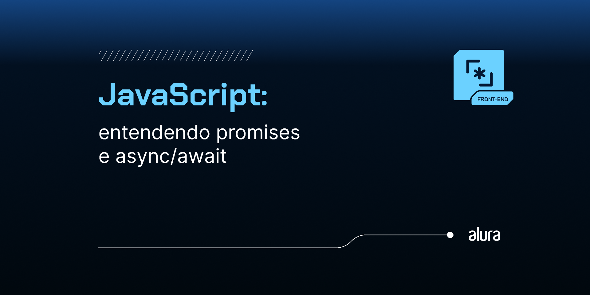
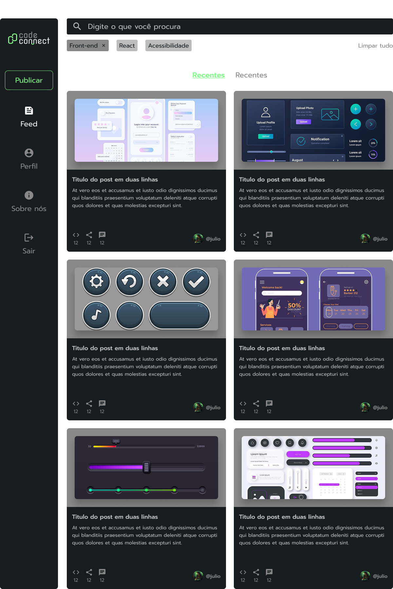

# CodeConnect

Este projeto faz parte do meu aprendizado de JavaScript, no curso da Alura: JavaScript: entendendo promises e async/await 

Neste projeto, desenvolvi uma plataforma para gestão de projetos de programação, chamada **CodeConnect**.

Link dos designs da aplicação: https://www.figma.com/design/SBfyvkkkbUt4M819oH29J9/JavaScript--entendendo-promises-e-async-await-%7C-CodeConnect--Community-?node-id=155-3098&p=f&t=hHcz5T6KJKSKQx30-0

## Sobre o projeto

## Funcionalidades do projeto

1. Gestão de projetos de programação
2. Gestão de tags do projeto para melhor identificação
3. Uso de imagens para identificar o projeto
4. Uso de promises e async/await para garantir todas as funcionalidades, sem gargalos ou erros

## Técnicas e Tecnologias

- `HTML`: criação dos elementos da tela;
- `CSS`: estilização da aplicação;
- `JavaScript`: construção de elementos dinâmicos através da manipulação do DOM.

## Como Abrir e Rodar o Projeto

1. Certifique-se de que você tem um navegador web moderno instalado. Recomendo o uso do Google Chrome ou Mozilla Firefox;
2. Abra a pasta onde o projeto foi baixado ou extraído, você encontrará um arquivo chamado index.html, a raíz do projeto;
3. Ao abrir o arquivo index.html, o projeto será aberto em seu navegador padrão, e você já poderá utilizar a aplicação.

Com isso, o projeto conta com uma funcionalidade completa de adição de projeto!
